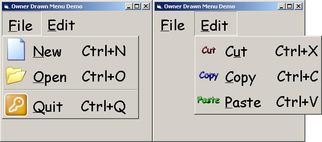



## Owner Drawn Menus

### Description

This module Creates Owner Drawn Menus for VB that provide MSAA information to be used with screen readers and speech synthesizers.
 
### More Info
 
Add the paths to the pictures to be displayed next to each menu item and run the code. More information in the readme file provided.

The user needs to have a good understanding of subclassing and WinAPI Rendering.

Some minimum Owner Drawn Menu Theory is required

The result is nice menus of any font size with an optional picture next to it.

There is a problem with MSAA: Information is not provided for SubMenus including top level menus. You have to provide this information manually. There is set of commented lines in the menu module that shows how to do this.

             |
---                |---
**Submitted On**   |2003-05-22 12:45:18
**By**             |[Miltiadis Kritikos](https://github.com/Planet-Source-Code/PSCIndex/blob/master/ByAuthor/miltiadis-kritikos.md)
**Level**          |Advanced
**User Rating**    |5.0 (25 globes from 5 users)
**Compatibility**  |VB 6\.0
**Category**       |[Custom Controls/ Forms/  Menus](https://github.com/Planet-Source-Code/PSCIndex/blob/master/ByCategory/custom-controls-forms-menus__1-4.md)
**World**          |[Visual Basic](https://github.com/Planet-Source-Code/PSCIndex/blob/master/ByWorld/visual-basic.md)
**Archive File**   |[Owner\_Draw1590985222003\.zip](https://github.com/Planet-Source-Code/miltiadis-kritikos-owner-drawn-menus__1-45638/archive/master.zip)

